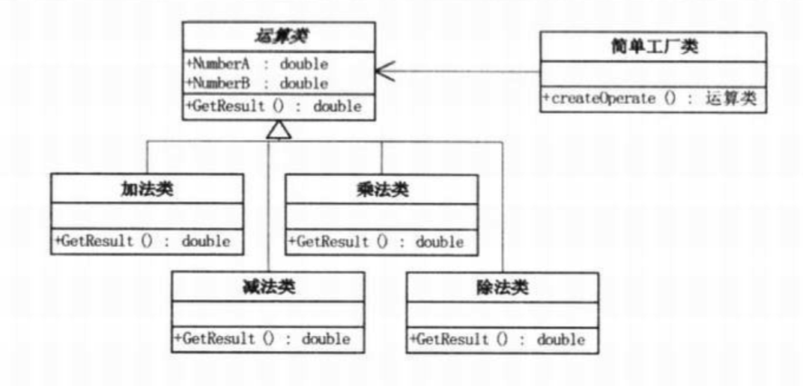
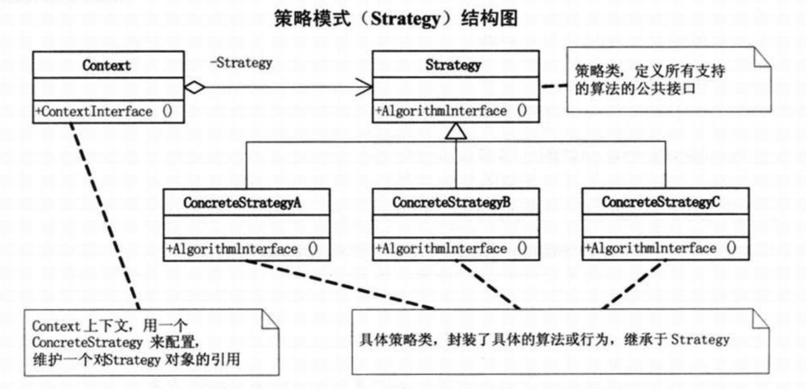
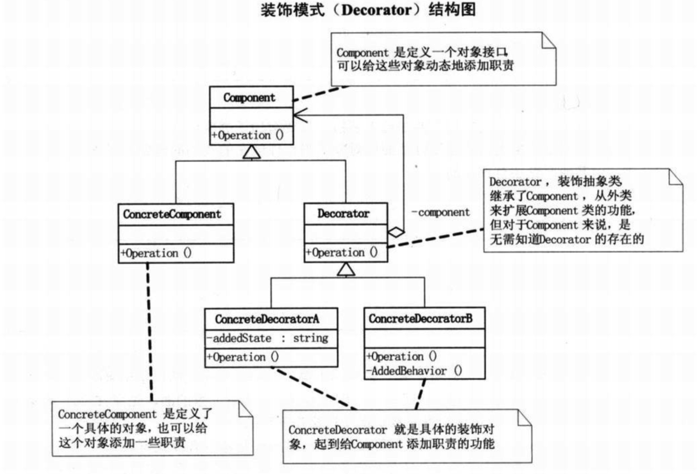
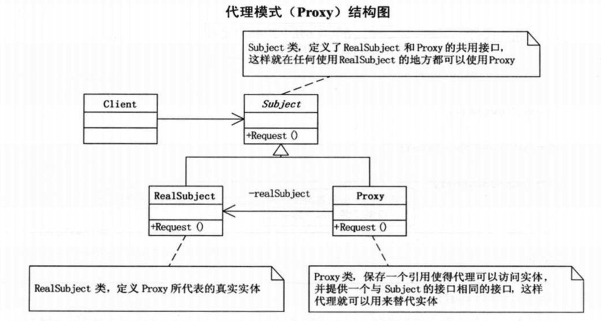
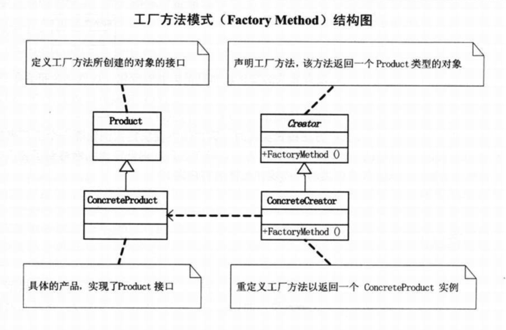
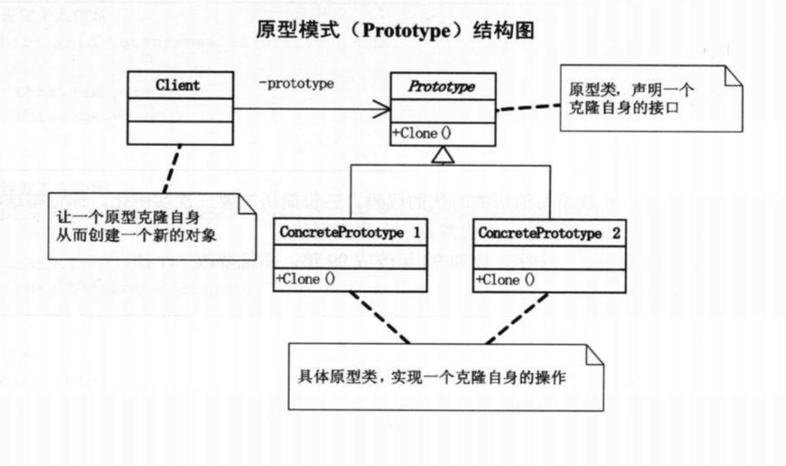
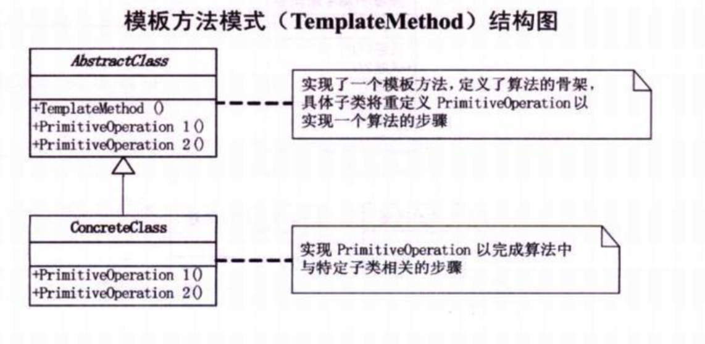
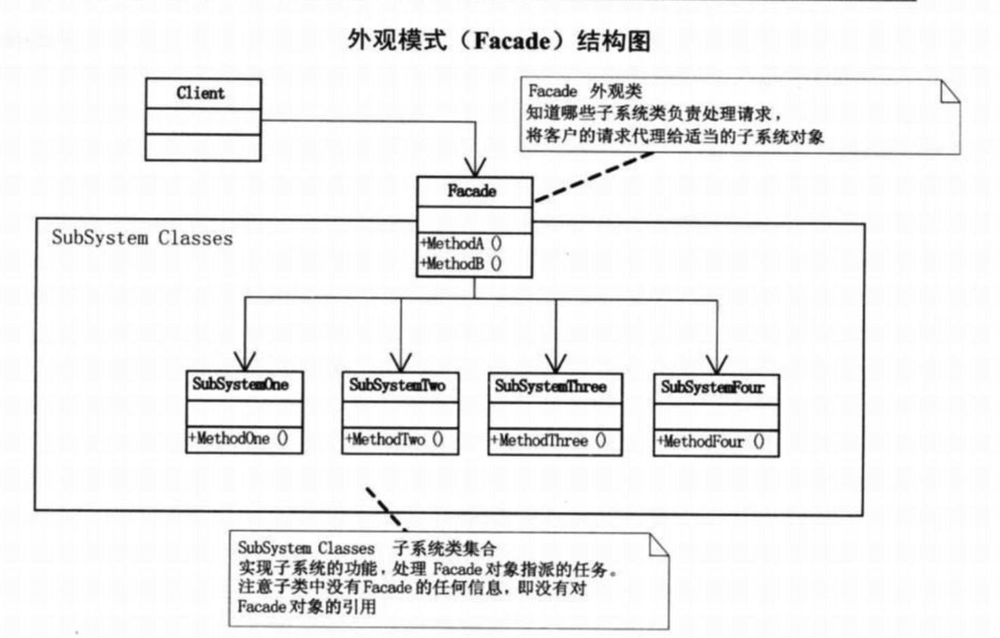

# iOS-design-patterns-learning
大话设计模式-入门  oc版本demo

## 设计模式的原则
### 单一职责原则
就一个类而言，应该仅有一个引起它变化的原因  

白话解释：就是如果需求变更了，频繁去修改一个类的代码，那么这个类就承担了过多的职责，违背了单一职责原则  

如果一个类承担的职责过多，就等于把这些职责耦合在一起，一个职责的变更可能会削弱或者抑制这个类完成其他职责的能力。这种耦合会导致脆弱的设计，当发生变化时，设计会遭到意想不到的破坏

### 开放-封闭原则
指软件实体(类、模块、函数等)应该可以扩展，但是不可以修改

白话解释：就是这个类或者模块，如果增加功能，可以通过增加代码的方式去做，原有的代码尽量少修改或者不修改就能实现(扩展性好。。)，对于扩展是开放的，对于修改是封闭的

无论模块是多么封闭，都会存在一些无法对之封闭的变化。既然无法完全封闭，开发人员必须对设计的模块对哪些变化封闭做出选择，他必须猜测最有可能发生的变化种类，然后构造抽象来隔离那些变化

开放封闭原则是面向对象设计的核心原则，遵循这个原则可以带来面向对象的好处(可维护、可扩展、可复用、灵活性好)，开发人员应该对程序中呈现出频繁变化的那些部分进行抽象，但是对于应用程序中的每个部分都刻意的抽象同样不是一个好主意，拒绝不成熟的抽象和抽象本身一样重要

### 依赖倒置原则

抽象不应该依赖于细节，细节应该依赖于抽象

白话解释：面向接口编程，而不是面对实现编程

依赖倒置原则：  
A: 高层模块不应该依赖低层模块，而应该是2者都依赖抽象接口
B: 抽象不应该依赖细节，细节应该依赖抽象

### 里氏代换原则
一个软件实体使用的是一个父类的话，那么一定适用其子类，而且它察觉不出父类对象和子类对象的区别

里氏代换原则其实可以看做是对依赖倒置原则的补充，如果我们按照接口进行编程，那么如果实现了接口的子类对象替换了，也可以

### 迪米特法则
如果2个类不必彼此直接通信，那么这2个类就不应当发生直接的相互作用。如果其中一个类需要调用另一个类的方法的话，可以通过第三方转发

### 

### 熟悉模式--基本案例
简单工厂模式： 加法计算器  

侧率模式：商场收银

装饰模式：小蔡打扮

代理模式：送礼物

工厂方法模式：学雷锋

原型模式：简历复制

模板方法模式：问卷

外观模式：股票&基金

### 模式分析=========

总体来说设计模式分为三大类：  
1、创建型模式，共五种：工厂方法模式、抽象工厂模式、单例模式、建造者模式、原型模式。  
2、结构型模式，共七种：适配器模式、装饰器模式、代理模式、外观模式、桥接模式、组合模式、享元模式。  
3、行为型模式，共十一种：策略模式、模板方法模式、观察者模式、迭代子模式、责任链模式、命令模式、备忘录模式、状态模式、访问者模式、中介者模式、解释器模式。  
1、创建型模式

软件设计的过程是循序渐进的，一步一步来的。在软件设计中对象的创建和对象的使用是分开的，因为对象的创建会消耗掉系统的很多资源，所以单独对对象的创建进行研究，从而能够高效地创建对象就是创建型模式要探讨的问题。这里就提供了多种创建型模式进行选择使用。  
2、结构型模式

在解决了对象的创建问题之后，对象的组成以及对象之间的依赖关系就成了开发人员关注的焦点，因为如何设计对象的结构、继承和依赖关系会影响到后续程序的维护性、代码的健壮性、耦合性等。所以也有多种结构型模式可供开发人员选择使用。  
3、行为型模式  

在对象的结构和对象的创建问题都解决了之后，就剩下对象的行为问题了，如果对象的行为设计的好，那么对象的行为就会更清晰，它们之间的协作效率就会提高。

简单工厂、工厂方法、抽象工厂：  
https://blog.csdn.net/xiaoddt/article/details/74937952